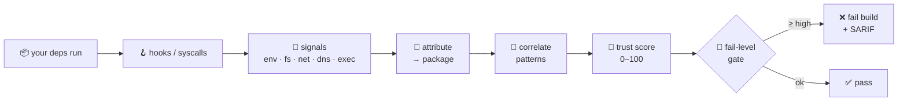
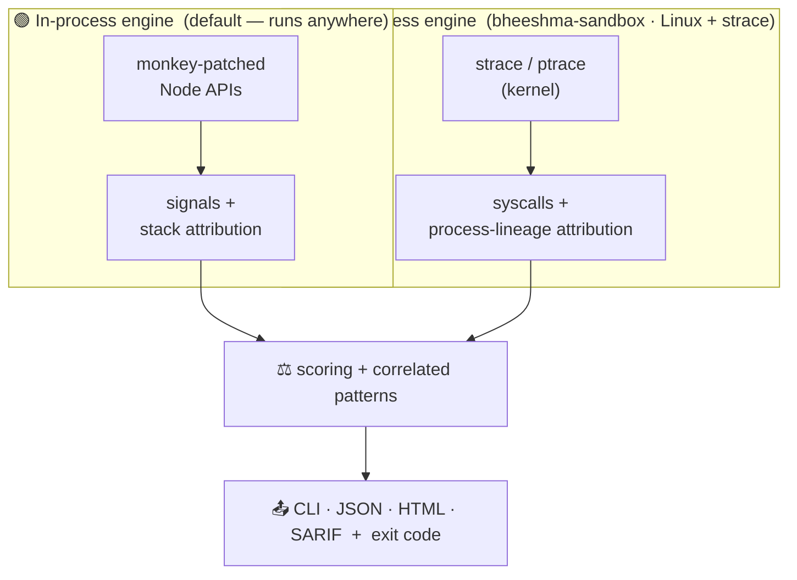

<div align="center">

# 🛡️ BHEESHMA

### Runtime dependency-behavior monitor for Node.js

**See what your npm dependencies *actually do* when they run — and gate your build on it.**

[](https://www.npmjs.com/package/bheeshma)
[](LICENSE)
[](https://nodejs.org/)
[]()
[]()

<a href="#-quick-start">Quick start</a> ·
<a href="#-two-engines">Two engines</a> ·
<a href="#-what-it-catches">What it catches</a> ·
<a href="#-measured-results">Measured results</a> ·
<a href="#%EF%B8%8F-cli-usage">CLI</a> ·
<a href="#-documentation">Docs</a>

</div>

---

## ⚡ See it in action

A package that quietly reads `~/.npmrc` and POSTs it to an unknown host — caught at runtime, scored, and failed in CI:

```console
$ npx bheeshma --enforce -- node app.js

══════════════════════════════════════════════════════════════════════
  BHEESHMA Runtime Dependency Behavior Report
══════════════════════════════════════════════════════════════════════
  📦 chalk-helper@2.4.1            Trust Score:  29/100   🔴 CRITICAL

  Observed behaviors
     🔐 ENV ACCESS   📖 FS READ ~/.npmrc   🌍 HTTPS REQUEST   🧭 DNS QUERY

  Pattern analysis — behavioral correlations  (2 threats)
     📤 Data exfiltration   CRITICAL   read .npmrc  +  outbound HTTPS
     🔑 Credential theft    HIGH       CREDENTIAL_FILE_READ — .npmrc
──────────────────────────────────────────────────────────────────────
  ✗ POLICY VIOLATION: chalk-helper@2.4.1 is CRITICAL          → exit 1
```

---

## 🤔 Why

Static and registry-graph scanners (Socket, Snyk, Dependabot, `npm audit`) reason about a package *before* it runs. BHEESHMA adds the missing, complementary view — **what your dependencies actually do when they execute** — and gates CI on it.



> [!WARNING]
> BHEESHMA's **default in-process engine runs with the same privileges as the code it watches** — it is telemetry and a detection aid, **not** a containment boundary, and a motivated attacker can evade or disable it. The optional out-of-process engine provides a real boundary. It is **defense-in-depth**, meant to run *alongside* static tooling. See **[docs/THREAT_MODEL.md](docs/THREAT_MODEL.md)** for exactly what each engine does and does not catch.

---

## 🧬 Two engines



| | 🟢 **In-process** (default) | 🔵 **Out-of-process** (`bheeshma-sandbox`) |
|---|---|---|
| How | Wraps Node APIs, attributes by stack | Kernel syscall tracing (`strace`/ptrace) |
| Per-package attribution of JS behavior | ✅ precise | ◑ per-process (great for installs) |
| Sees native subprocess egress (`curl`…) | ❌ | ✅ |
| Resists the watched code disabling it | ❌ | ✅ |
| Can **prevent**, not just detect | ❌ | ✅ `--block-network` |
| Runs anywhere / zero deps | ✅ | Linux + `strace` |

> [!TIP]
> Use the **in-process** engine for fast, precise CI signal everywhere; add the **out-of-process** engine where native egress, evasion-resistance, or *prevention* matter — e.g. monitoring `npm install`. Details in **[docs/ARCHITECTURE.md](docs/ARCHITECTURE.md)**.

---

## 🚀 Quick start

**GitHub Actions** — annotates every PR via Code Scanning:

```yaml
# .github/workflows/ci.yml
- uses: bb1nfosec/bheeshma/.github/actions/bheeshma@v3.0.0
  with:
    command: 'npm test'
    fail-level: 'high'   # default; see docs/ENTERPRISE.md for tuning
```

**Locally:**

```bash
npx bheeshma -- node app.js          # monitor any command
npx bheeshma install                 # monitor `npm install` (postinstall scripts)
npx bheeshma --format sarif -o results.sarif -- npm test

# out-of-process engine (Linux + strace): observe + optionally PREVENT egress
npx -p bheeshma bheeshma-sandbox --enforce -- npm ci
npx -p bheeshma bheeshma-sandbox --block-network -- npm ci
```

---

## 🎯 What it catches

| Behavior | Signal | Detects |
|---|---|---|
| 🔐 Env access | `ENV_ACCESS` | Credential / API-key theft |
| 📖 File read | `FS_READ` | Recon, credential-file access |
| 📝 File write | `FS_WRITE` | Persistence, backdoor install |
| 🌐 TCP connect | `NET_CONNECT` | Reverse shells, C2 |
| 🌍 HTTP / HTTPS | `HTTP(S)_REQUEST` | Data exfiltration (incl. `.get`) |
| 🧭 DNS query | `DNS_QUERY` | DNS tunneling / encoded-subdomain exfil |
| ⚡ Shell exec | `SHELL_EXEC` | Arbitrary code execution |
| 🌀 Obfuscation | `OBFUSCATION_DETECTED` | Hidden payloads (eval/Function/hex) |

<details>
<summary><b>🔗 Correlated patterns</b> — combinations that cap the trust score into a risk band</summary>

<br/>

- **Data exfiltration** — credential read **+** outbound connection → `CRITICAL/HIGH`
- **DNS tunneling** — high-entropy / known-exfil query names → `HIGH`
- **Backdoor** — reverse-shell command or suspicious port → `CRITICAL/HIGH`
- **Persistence** — writes to shell rc / cron / `~/.ssh/authorized_keys` / systemd → `HIGH`
- **Credential theft** — secret-env read **+** egress; context-aware `.env` reads (dotenv = expected) → `HIGH/LOW`
- **Crypto mining** — wallet / pool indicators → `CRITICAL`
- **Typosquat** — name 1 edit from a popular package → `MEDIUM`
- **Obfuscation + network** — obfuscated source making outbound calls → `HIGH`

</details>

**Trust score & gate** — each package gets a deterministic score `[0–100]` → `<30` 🔴 CRITICAL · `<60` 🟠 HIGH · `<80` 🟡 MEDIUM · else 🟢 LOW. The CI gate fails at or above `fail-level`, which **defaults to `high`**.

---

## 📊 Measured results

> Evidence, not adjectives. Reproduce: `npm run benchmark` · `node benchmark/fp-real.js` · `npm run perf`. Full detail + caveats in **[benchmark/FINDINGS.md](benchmark/FINDINGS.md)**.

| Gate | 🎯 Detection (modeled attacks) | 🟢 False positives (71 real packages) |
|---|:---:|:---:|
| `critical` | 29% | **0%** |
| **`high` (default)** | **💯 100%** | **0%** |

⚙️ **Overhead** ≈ 6.7× on a *worst-case pure-hook* microbenchmark (real workloads are far lower — most time is non-hooked work).

> [!NOTE]
> Detection corpora are synthetic/limited — **validate against your own dependency tree** before relying on the gate. This measures real-world npm malware classes, not nation-state evasion.

---

## ⌨️ CLI usage

```bash
bheeshma -- <command>                # monitor (in-process)
bheeshma-ci -- <command>             # CI-tuned: SARIF + exit codes
bheeshma install [ci]                # monitor npm install / npm ci
bheeshma-sandbox -- <command>        # out-of-process (strace); --block-network to prevent egress

bheeshma --format <cli|json|html|sarif> -o report.ext -- <command>
bheeshma --enforce --fail-level high -- npm test    # exit 1 at/above fail-level (default high)
```

<details>
<summary><b>📦 Programmatic API</b></summary>

```javascript
const bheeshma = require('bheeshma');
bheeshma.init();
require('./your-app');
console.log(bheeshma.generateReport('json'));
const result = bheeshma.enforcePolicy({ failLevel: 'high' });
if (!result.passed) process.exit(1);
```

Types ship in the package (`src/index.d.ts`), validated against the runtime by a drift-guard test.
</details>

<details>
<summary><b>🤖 GitHub Action inputs</b> (SARIF v2.1.0 → Code Scanning annotations)</summary>

<br/>

| Input | Default | Description |
|---|---|---|
| `command` | _(required)_ | Command to run under monitoring |
| `fail-level` | `high` | Min risk to fail the build (`critical`/`high`/`medium`/`low`) |
| `config` | `''` | Path to `.bheeshmarc.json` |
| `sarif-output` | `bheeshma-results.sarif` | SARIF output path |
| `skip-low` | `true` | Skip LOW signals in SARIF (less noise) |
| `upload-sarif` | `true` | Upload to Code Scanning |
</details>

<details>
<summary><b>🛠️ Configuration</b> (<code>.bheeshmarc.json</code>, entirely optional)</summary>

```json
{
  "thresholds": { "critical": 30, "high": 60, "medium": 80 },
  "packageThresholds": { "axios": 40 },
  "whitelist": ["express@*", "@types/*"],
  "blacklist": ["known-malicious-package"],
  "patterns": { "enabled": true },
  "performance": { "maxSignals": 10000, "deduplicateSignals": true }
}
```
</details>

---

## 🔒 Data handling

- 🚫 **No telemetry, local-only** — all analysis runs on your machine (the only outbound is an optional alert webhook you configure).
- 🏷️ **Metadata only** — records hosts, ports, paths, env-var *names*; never secret values, file contents, or request bodies.
- 📭 **Zero dependencies** and **no install scripts** — a security tool shouldn't run the very thing it warns about.
- 🛟 **Fail-safe** — hook errors never break your application.

---

## 📚 Documentation

| | |
|---|---|
| 🧬 **[Architecture](docs/ARCHITECTURE.md)** | the two-engine design and trade-offs |
| ⚠️ **[Threat model](docs/THREAT_MODEL.md)** | what it does and does **not** catch — *read before relying on it* |
| 🏢 **[Enterprise guide](docs/ENTERPRISE.md)** | deployment, gating, assurance, evaluation checklist |
| 📊 **[Benchmark findings](benchmark/FINDINGS.md)** | measured detection / false-positive results |
| 📋 **[Roadmap](ROADMAP.md)** · **[Release checklist](docs/RELEASE_CHECKLIST.md)** | what's next, how releases are cut |

---

## 🧨 Wall of Shame

A live threat-intel dashboard tracking known npm supply-chain attacks and how bheeshma's signals map to them:

<div align="center">

[](https://bb1nfosec.github.io/bheeshma/)

</div>

Auto-updates daily from the OSV API + a curated threat set (`scripts/fetch-threats.js`).

---

## 🧪 Testing

```bash
npm test               # 75 tests: in-process harness + CLI integration (offline, deterministic)
npm run benchmark      # efficacy benchmark (detection / FP by gate)
npm run perf           # monitoring-overhead microbenchmark
node benchmark/fp-real.js   # false-positive sweep on real packages (needs network)
```

CI runs the unit, CLI-integration, and benchmark suites across Node 14 / 18 / 20 / 22.

---

## 🤝 Contributing

PRs welcome — see [CONTRIBUTING.md](CONTRIBUTING.md). Especially valuable: real-world attack replay scripts ([demos/](demos/)), false-positive reports with repros, new hook/syscall coverage, and out-of-process engine work (eBPF, seccomp/Landlock).

## 📄 License

[Apache 2.0](LICENSE)

---

<div align="center">

**BHEESHMA** — *trust, but verify. At runtime.* 🛡️

</div>
